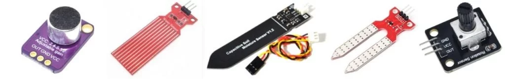

# Сборка схемы из модулей

Микроконтроллер - очень универсальная штука, его можно научить взаимодействовать практически с любым другим электронным устройством: аналоговые датчики, цифровые датчики, всякие разные микросхемы, дисплеи, драйверы, контроллеры... Чтобы схема работала, входящие в неё компоненты нужно правильно соединить между собой. В этом уроке мы рассмотрим подключение электронных модулей.

## Электронный модуль

Модуль - это специальная удобная плата на базе какой-то микросхемы или электронного компонента. Модуль может быть датчиком, драйвером, интерфейсом, памятью, дисплеем и так далее. Зачем использовать модуль, почему не взять конкретный компонент? Если вы хотите делать электронное устройство на печатной плате - конечно же лучше собирать его из голых компонентов, а не из модулей, потому что в большинстве случаев это выйдет дешевле, а также изготовление такой платы можно заказать вместе со сборкой на производстве (например на JLCPCB). Но мы с вами собираемся сначала научиться программировать, поэтому модули имеют неоспоримые преимущества:

- Основная концепция Ардуино - электронный конструктор, быстрое и простое создание прототипов электронных устройств без помощи паяльника.
- Микросхема очень маленькая, подключать её к чему-то - не очень приятная затея. У модуля выведена рейка для подключения проводов и работы на макетной плате.
- Чтобы подключить голую микросхему - понадобится изучить документацию. У модуля все нужные для подключения пины выведены и подписаны.
- Для корректной работы большинства микросхем требуются дополнительные компоненты (драйверы, контроллеры, резисторы, стабилизаторы, конденсаторы, индуктивности, кварцевые генераторы), посчитанные, выбранные и установленные согласно документации. На плате модуля всё это уже есть.
- У некоторых модулей на плате предусмотрена настройка: крутилки, джамперы, переключатели, перемычки для спайки паяльником.

## Макетная плата

Макетная плата, она же макетка или брэдборд (breadboard) – самый удобный способ создания электронных макетов. Отверстия расположены со стандартным шагом 2.54мм, внутри каждого - пружинная клемма. Это позволяет вставлять в плату любые Arduino-модули, а также микросхемы в DIP корпусах.

Для соединения отверстий в пределах макетки используются провода штырёк-штырёк, рекомендую вариант с цилиндрическими штекерами (я пользуюсь одним комплектом на протяжении уже 5-ти лет). Также существуют провода с квадратными штекерами, они есть в вариантах гнездо-гнездо, гнездо-штырёк и штырёк-штырёк. Эти провода менее качественные, но вариант гнездо-штырёк позволяет подключить модуль к макетке, не втыкая модуль в макетку:

Что происходит на этом фото и как работает брэдборд? Очень просто! Контакты в нём соединены следующим образом:

## "Простые" модули

### Цифровые

Простые цифровые модули имеют два пина питания и пин с логическим выходом, он может быть подписан как OUT, S, D или DO. Плата таких модулей имеет синий цвет и содержит типовую схему - крутилка (синий корпус) и операционный усилитель (чёрная микросхема рядом с крутилкой). Такой модуль выдаёт только два состояния: датчик "сработал" и "не сработал", на цифровом выходе появляется соответственно VCC (напряжение питания) или 0 Вольт, т.е. высокий и низкий цифровой сигнал. Крутилка на плате позволяет настроить порог срабатывания. Такие датчики подключаются к питанию и любому цифровому пину (GPIO). Опрашиваются стандартными средствами Arduino.

Примеры на картинке ниже: датчик звука, температуры, освещённости, приближения, магнитного поля.

### Аналоговые

У аналоговых модулей помимо питания есть аналоговый выход, может быть маркирован как OUT, S, A или AO. Такие модули выдают аналоговый сигнал, пропорциональный показанию датчика. Подключаются к питанию и любому аналоговому пину (ADC) и опрашиваются стандартными средствами Arduino.

Примеры на картинке ниже: датчик звука, уровня жидкости, индуктивный датчик влажности почвы, обычный датчик влажности почвы, потенциометр (просто крутилка).

### Смешанные

Некоторые модули имеют цифровой и аналоговый выходы одновременно, пины у них обычно подписаны как DO – цифровой выход и AO – аналоговый. Крутилка на плате настраивает порог срабатывания у цифрового выхода, а аналоговый просто выдаёт "сырой" сигнал с датчика. Опрашиваются как цифровые и аналоговые датчики соответственно.

Общая схема для всех перечисленных выше типов модулей:

Примеры на картинке ниже: датчик вибрации, звука, магнитного поля, влажности почвы и освещённости.

### KY-модули

Существует также целое семейство модулей с названием KY-цифра, это самые дешёвые модули на чёрных платах. Среди них есть и цифровые, и аналоговые, и интерфейсные датчики, а также индикация (светодиоды, пищалки) и реле. Проблема в том, что пины почти у всех плат подписаны одинаково:

- (минус) - минус, GND
- Средний пин без подписи - плюс, VCC
- S - сигнал

Сигналом здесь может быть как исходящий из датчика цифровой или аналоговый сигнал, так и цифровой сигнал управления, который нужно подать на модуль с микроконтроллера. Обязательно читайте описание к модулю такого типа, если не знаете, что делает компонент на его плате!

## Интерфейсные модули

Некоторые модули имеют один или несколько логических выходов и передают данные по цифровому интерфейсу связи. Сигнальные пины таких датчиков могут быть подписаны как SCK, SDA, SCL, MISO, MOSI, SS и прочими аббревиатурами, отличными от OUT, как в "простых" модулях. Подключаются такие модули к пинам интерфейсов (подробнее в этом уроке) на плате и опрашиваются при помощи сторонних библиотек. Для работы с такими модулями нужно найти в интернете статью с описанием и примерами. Подробное описание к некоторым популярным модулям можно найти в базе примеров к набору GyverKIT, а также у меня в каталоге ссылок на Ардуино-компоненты. Примеры таких модулей:

Давайте вкратце рассмотрим самые распространённые интерфейсы и особенности подключения модулей с ними. Напомню распиновку плат Arduino Nano и Wemos Mini:

### UART

- Названия пинов:
  - TX
  - RX
  - Подключение осуществляется "наоборот": RX -> TX, TX -> RX
- В общем случае поддерживает подключение только одного устройства.
- Примеры устройств: Bluetooth, LoRa радио, GPS и GSM модули, а также некоторые датчики (газоанализаторы, дальномеры).

### I2C (Wire)

- Названия пинов (в скобках указаны варианты надписей на плате модуля):
  - SDA (D)
  - SCL (C, SCK)
- Подключение осуществляется в пины с таким же названием, смотрите распиновку своей платы
- Данный интерфейс является шиной, то есть к нему можно подключить параллельно до 128 устройств с уникальными адресами.
- Примеры устройств: различные датчики, дисплеи и микросхемы памяти.

### SPI

- Названия пинов (в скобках указаны варианты надписей на плате модуля):
  - MOSI (SDI, DI, DIN, SI)
  - MISO (SDO, DO, DON, SO)
  - SCLK (SCK, CLK, SPC)
  - CS (SS, RCK) – на любой GPIO
- Подключение осуществляется в пины с таким же названием (за исключением CS)
  Данный интерфейс также является шиной и поддерживает подключение по сути неограниченного количества устройств: у модуля есть пин CS (Chip Select), который МК подключает к GND для выбора данного модуля в качестве текущего устройства приёма и передачи данных.
- Примеры устройств: дисплеи, радио модули, микросхемы памяти.

