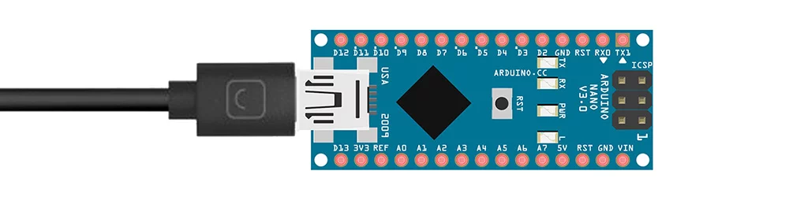
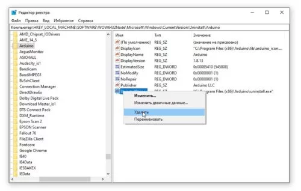
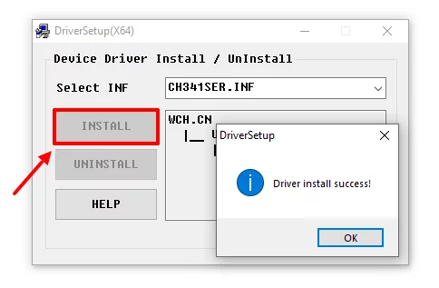
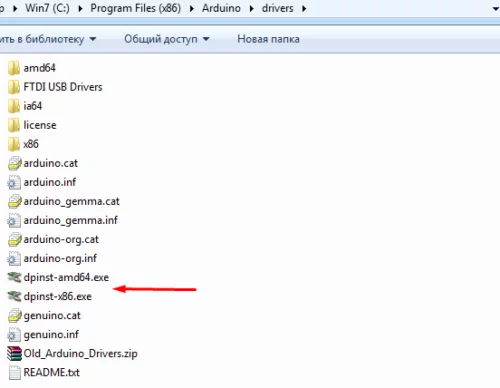

# Начало работы с Arduino IDE

Для работы с Ардуино нам понадобится компьютер (или смартфон), USB data-кабель и некоторый софт.

**Компьютер** с Windows 7 или выше. На WinХР новые версии Arduino IDE либо работают очень плохо, либо не работают вовсе. Также не компилируются некоторые библиотеки и ядро esp8266. MacOS и Linux-подобные оси тоже подходят, так как среда разработки Arduino IDE кроссплатформенная. Программировать Ардуино можно с планшета или даже смартфона под Андроид при помощи официального приложения, соответственно смартфон/планшет должен иметь поддержку OTG (подключение и работа с внешними устройствами через USB порт). Но это большое извращение, а также не все библиотеки будут компилироваться на смартфоне.

**USB кабель** должен быть именно Data-кабелем, по такому кабелю передаются данные (например таким подключается к компьютеру смартфон/фотоаппарат/плеер). Есть три типа USB штекера, которые используются на платах Ардуино: mini-USB (Arduino Nano), micro-USB (Wemos Mini, NodeMCU) и USB type B (Arduino UNO, MEGA), бывают и китайские поделки на USB type C. Кабель можно купить у китайцев, иногда он идёт в комплекте с платой, можно взять в наших магазинах (~50 рублей), либо просто поискать на полке.

## Arduino IDE

### Установка

Среда разработки **Arduino IDE**, качаем с официального сайта и устанавливаем актуальную версию для своей операционной системы. В окне загрузки жмём JUST DOWNLOAD, чтобы начать загрузку без пожертвования

- Прямая ссылка на установщик 1.8.13 для Windows 7 и выше
- Если у вас Windows XP – качаем версию 1.6.13
- Во время установки программа попросит установить драйвер – **соглашаемся на всё**
- Установка на Linux из системного репозитория – читать тут
- Установка на MacOS – читать тут
- **_КРИТИЧЕСКИ НЕ РЕКОМЕНДУЕТСЯ_** ставить **Arduino Windows app** из магазина приложений Windows 10, а также **Beta Builds, Hourly Builds и старые версии IDE!**

### Распаковка портативной версии

Вместо полной установки программы можно скачать архив с уже “установленной”, на странице загрузки он называется Windows ZIP file. Вот прямая ссылка на 1.8.13. Распаковав архив, получим портативную версию Arduino IDE, которую можно скинуть на флешку и использовать на любом компьютере без установки программы. Но понадобится установить драйвер для китайских плат, а также драйверы из папки с программой Arduino IDE. Возможно понадобится установить Java.

### Обновление IDE

Перед установкой новой версии нужно удалить старую. Ни в коем случае не удаляйте папку установленной IDE из Program Files, удалять нужно через “**Установка и удаление программ**“, либо запустив файл uninstall.exe из папки с установленной программой. Иначе установщик откажется устанавливать новую программу, так как в системе остались следы от старой. Решение этой проблемы описано в видео ниже. Вкратце о том, как удалить IDE вручную:

Удаляем папки:

- Папка с программой
  - C:\Program Files (x86)\Arduino\ (64-битная версия Windows)
  - C:\Program Files\Arduino\ (32-битная версия Windows)
- Папка со скетчами и библиотеками
  - Документы\Arduino\
- Папка с настройками и дополнительными “ядрами” плат

  - C:\Пользователи (или Users)\Ваш_пользователь\AppData\Local\Arduino15\
    Удаляем следы из реестра:

- Открыть редактор системного реестра:
  - Windows 10: Пуск/regedit
  - Предыдущие: Пуск/Выполнить/regedit
- В открывшемся окне: Правка/Найти…
  - В окне поиска пишем arduino\uninstall
  - Поиск
- Удаляем найденный параметр (см. скриншот ниже)
- На всякий случай Правка/Найти далее
- Удаляем и так далее, пока не удалим все найденные параметры с arduino\uninstall
- После этого можно запускать установщик и устанавливать новую программу

### Решение проблем

- Если перестала запускаться Arduino IDE – удаляем файлик preferences.txt из C:\Пользователи (или Users)\Ваш_пользователь\AppData\Local\Arduino15\

## Драйверы

Оригинальные платы от Arduino используют USB контроллер производства FTDI, либо отдельный микроконтроллер в качестве USB интерфейса. Если вы используете китайские платы, то вам понадобится дополнительный драйвер на китайский USB-TTL контроллер. Называется он CH340 (CH341), является производимым в Китае дешёвым аналогом дорогого шведского FTDI чипа.

Скачать драйвер CH341 можно по ссылкам:

- [Официальный сайт](https://wch-ic.com/downloads/CH341SER_EXE.html)

Запускаем и в появившемся окошке нажимаем INSTALL. Готово!

Если во время установки Arduino IDE вы по какой-то причине пропустили установку драйверов, то их можно установить вручную из папки с программой, расположенной по пути

- C/Program Files/Arduino/drivers (для 32-х разрядной системы)
- C/Program Files (x86)/Arduino/drivers (для 64-х разрядной системы).
  Запустить файл

- **dpinst-x86.exe** (для 32-х разрядной системы)
- **dpinst-amd64.exe** (для 64-х разрядной системы)

В Linux уже встроен необходимый драйвер, но Arduino IDE может отказаться с ним работать: Linux определяет ардуинку как устройство ttyUSB\*, обычно это ttyUSB0 (это можно узнать командой dmesg в терминале), то есть в системе появляется интерфейс /dev/ttyUSB0. Чтобы с ним работать, нужны права доступа. Читать и писать на устройство /dev/ttyUSB0 имеет пользователь root и пользователи группы dialout. Работы с правами суперпользователя лучше избегать, поэтому следует занести своего пользователя в группу dialout. Это можно сделать следующей командой (обратите внимание, команда whoami в обратных кавычках)

**sudo usermod -a -G dialout `whoami`**

После этого нужно перелогиниться. Дальше запускаем Arduino IDE и в меню «Инструменты/Порт» ставим галочку напротив /dev/ttyUSB0

После установки и настройки всего необходимого можно попробовать прошить плату. Запускаем Arduino IDE и переходим к следующему уроку, где эту самую IDE рассмотрим более подробно.
