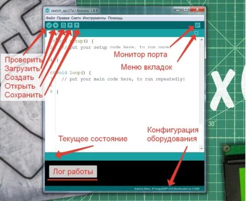

# Работа с Arduino IDE

Сначала рассмотрим общий вид программы, т.е. как она выглядит после запуска. В самом центре – блокнот, то самое место, где пишется код. По умолчанию уже написаны два стандартных блока, setup() и loop(). К ним вернёмся в разделе уроков программирования. Всё остальное можно увидеть на скриншоте ниже.

- **Проверить** – компиляция (сборка, проверка на ошибки…) кода без его загрузки в плату. То есть код можно написать и проверить на ошибки даже не подключая плату к компьютеру.
- **Загрузить** – компиляция и загрузка прошивки в плату.
- **Создать/открыть/сохранить** – действия с текущим скетчем (файл с кодом программы).
- **Монитор порта** – кнопка открывает монитор последовательного пора для общения с платой.
- **Меню вкладок** – работа с вкладками, о них поговорим ниже.
- **Текущее состояние** – тут выводится краткая информация о последнем действии: загрузка завершена, ошибка загрузки, автоформатирование завершено и т.д.
- **Лог работы** – тут выводится лог компиляции и вообще все системные сообщения, отчёты об ошибках и размере скомпилированного кода.
- **Конфигурация оборудования** – выводится название выбранной платы, версии микроконтроллера и номер выбранного COM порта.

Пробежимся по пунктам меню, которые я считаю первостепенно важными, с остальными можно познакомиться самостоятельно по ходу работы с программой. Версия моей IDE – 1.8.8, в новых что-то может отличаться

## Вкладка “Файл”

- Новый
- Открыть
- Открыть недавние
- Папка со скетчами – список скетчей, которые сохранены туда, куда программа предлагает их сохранять по умолчанию (Документы/Arduino)
- Примеры – список установленных библиотек с подсписком примеров к каждой.
- Закрыть
- Сохранить
- Сохранить как…
- Настройки страницы (для печати)
- Печать
- Настройки
- Выход

## Окно настроек

**Размещение папки скетчей** – куда по умолчанию сохраняются скетчи
**Показать подробный вывод** – показывает подробный лог при компиляции и загрузке, нужно при поиске багов и непонятных глюков/ошибок
**Использовать внешний редактор** – запрещает редактирование кода из Arduino IDE, чтобы редактировать его в других редакторах, например Notepad++. Редактируем там, а загружаем через IDE.
**Дополнительные ссылки для менеджера плат** – сюда вставляются ссылки на пакеты для работы с другими платами, например такими основанными на ESP8266 или ATtiny85.

## Вкладка “Скетч”

- **Проверить/компилировать** – то же, что кнопка "галочка".
- **Загрузка** – то же, что кнопка "стрелочка".
- **Загрузить через программатор** – загрузить скетч напрямую в МК через программатор.
- **Экспорт бинарного файла** – компилирует код и сохраняет в бинарник.
- **Показать папку скетча**
- **Подключить библиотеку** – подключает в код библиотеку.
  - **Управлять библиотеками…** – открывает менеджер библиотек, из которого можно устанавливать библиотеки.
  - **Добавить .zip библиотеку** – установка библиотеки из zip файла, если вы его откуда-то скачали.
- **Добавить файл…**– подключает в код внешний файл.

## Вкладка “Инструменты”

- **АвтоФорматирование** – выравнивает код по табуляции. Крайне важная фишка, используйте её (комбинация Ctrl+T) как можно чаще.
- **Архивировать скетч** – сохраняет скетч как .zip архив.
- **Исправить кодировку и перезагрузить** – полезная штука, когда скачал чей-то код из интернета, а там поехала кодировка.
- **Управлять библиотеками…** – открывает менеджер библиотек, из которого можно устанавливать библиотеки.
- **Монитор порта.**
- **Плоттер по последовательному соединению** – встроенный построитель графиков по идущим в порт данным.
- **Плата** – выбор платы, куда хотим загрузить прошивку.
- **Порт** – COM порт, к которому подключена плата. Это всегда порт, отличный от COM1 (системный порт)
- **Программатор** – выбор программатора для загрузки кода через программатор.
- **Записать загрузчик** – прошивает загрузчик, соответствующий выбранной плате и процессору в микроконтроллер при помощи программатора.

## Меню вкладок

Система вкладок в Arduino IDE работает крайне необычным образом и очень отличается от понятия вкладок в других программах, подробнее - в отдельном уроке.

## Аналоги Arduino IDE

Всем нетерпимо относящимся к кривой официальной IDE могу посоветовать следующие аналоги, работа в которых чем-то лучше, а чем-то хуже официальной IDE:

- **Notepad++ + Arduino IDE** – вполне работоспособная связка – прогерский блокнот, в котором очень удобно писать код, и Arduino IDE, в которой удобно выбирать железо и загружать прошивку. Скачать блокнот можно с официального сайта.
- **Atmel Studio** – официальная среда для программирования микроконтроллеров AVR. Никаких детских ардуиновских функций – только работа напрямую с МК, только хардкор! Подробнее можно почитать на сайте амперки.
- **PlatformIO** – очень мощная взрослая среда разработки.
- **Programino IDE** – вот эта среда мне довольно таки понравилась, есть автодополнение и другие удобные фичи. Единственный минус – она платная, но на всё платное можно нагуглить кряк =) Подробнее на официальном сайте
- **B4R** – среда, позволяющая программировать Арудино на языке Basic. Кому интересно – вот официальный сайт
- **XOD** – очень интересная среда разработки, в которой программа составляется из нод (node) – блоков. Полностью другая концепция программирования, посмотрите обязательно. Официальный сайт.
- **FLProg** - ещё одна блочная среда разработки, в которой используются блоки вместо кода. Подойдёт для очень молодых или очень старых ардуинщиков. Официальный сайт.

## Симуляторы

- **Wokwi** - пожалуй лучший онлайн-симулятор Arduino. Полностью эмулирует работу микроконтроллера, отлично подходит для теста различных алгоритмов. Имеет автодополнение кода и менеджер библиотек. Можно собирать схемы из доступных железок, тоже всё работает как в жизни. Официальный сайт.
- **Tinkercad** - "детский" симулятор с небольшим набором железок и возможностей, не рекомендую. Официальный сайт.
