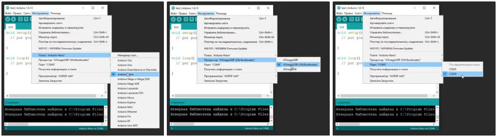

# Первая прошивка, ошибки, FAQ

## Первая прошивка

Итак, разобрались со средой разработки, теперь можно загрузить прошивку. Рекомендую загрузить пустую прошивку, чтобы убедиться, что все драйвера установились и плата вообще прошивается. Также лучше делать это с новой или заведомо рабочей платой.

1. Плата подключается к компьютеру по USB, на ней должны замигать светодиоды. Если этого не произошло:

   - Неисправен USB кабель.
   - Неисправен USB порт компьютера.
   - Неисправен USB порт Arduino.
   - Попробуйте другой компьютер, чтобы исключить часть проблем из списка.
   - Попробуйте другую плату, чтобы исключить часть проблем из списка.
   - На плате Arduino сгорел диод по питанию USB.
   - Плата Arduino сгорела полностью из-за неправильного подключения питания или короткого замыкания

2. Компьютер издаст характерный сигнал подключения нового оборудования, а при первом подключении появится окошко “Установка нового оборудования”. Если этого не произошло:

   - См. предыдущий список неисправностей.
   - Кабель должен быть data-кабелем, а не “зарядным”.
   - Кабель желательно втыкать напрямую в компьютер, а не через USB-хаб.
   - Не установлены драйверы для Arduino. 3. В списке портов (Arduino

3. IDE/Инструменты/Порт) появится новый порт, отличный от COM1. Если этого не произошло:

   - См. предыдущий список неисправностей.
   - Некорректно установлен драйвер CH341.
   - Если список портов вообще неактивен – драйвер Arduino установлен некорректно, вернитесь к установке
   - Возникла системная ошибка, обратитесь к знакомому компьютерщику

   - 

4. Выбираем свою плату. Если это Arduino Nano, выбираем в Инструменты\Плата\Arduino Nano. Если другая – выбираем другую. Нажимаем стрелочку в левом верхнем углу (загрузить прошивку). Да, загружаем пустую прошивку.

   - [Для Arduino Nano] В микроконтроллер китайских нанок зашит “старый” загрузчик, поэтому выбираем Инструменты\Процессор\ATmega328p (Old Bootloader). Некоторые китайцы зашивают в свои платы новый загрузчик, поэтому если прошивка не загрузилась (загрузка идёт минуту и вылетает ошибка avrdude: stk500_getsync()) – попробуйте сменить пункт Процессор на ATmega328p.

Если появилась надпись “**Загрузка завершена**” – значит всё в порядке и можно прошивать другие скетчи. В любом случае на вашем пути встретятся другие два варианта событий, происходящих после нажатия на кнопку “Загрузка” – это ошибка компиляции и ошибка загрузки. Вот их давайте рассмотрим более подробно.

## Ошибки компиляции

Возникает на этапе компиляции прошивки. Ошибки компиляции вызваны проблемами в **коде прошивки**.

- В некоторых случаях ошибка возникает при наличии **кириллицы** (русских букв) в пути к папке со скетчем. Решение: завести для скетчей отдельную папочку в корне диска с **английским названием**.
- В чёрном окошке в самом низу Arduino IDE можно прочитать **полный текст ошибки** и понять, куда копать.
- В скачанных с интернета готовых скетчах часто возникает ошибка с описанием название_файла.h no such file or directory. Это означает, что в скетче используется библиотека **<название файла>**, и нужно положить её в Program Files/Arduino/libraries/. Ко всем моим проектам всегда идёт папочка с использованными библиотеками, которые нужно установить. Также библиотеки всегда можно поискать в гугле по **название файла**.
- При использовании каких-то особых библиотек, методов или функций, ошибкой может стать неправильно выбранная плата в “Инструменты/плата“. **Пример**: прошивки с библиотекой Mouse.h или Keyboard.h компилируются только для Leonardo и Micro.
- Если прошивку пишете вы, то любые синтаксические ошибки в коде будут подсвечены, а снизу в чёрном окошке можно прочитать более детальное описание, в чём собственно косяк. Обычно указывается строка, в которой сделана ошибка, также эта строка подсвечивается красным.
- Иногда причиной ошибки бывает слишком старая, или слишком новая версия Arduino IDE. Читайте комментарии разработчика скетча
- Ошибка недостаточно свободного места возникает по вполне понятным причинам. Возможно поможет урок по оптимизации кода.

## Частые ошибки в коде, приводящие к ошибке компиляции

- expected ‘,’ or ‘;’ – пропущена запятая или точка запятой на предыдущей строке
- stray ‘\320’ in program – русские символы в коде
- expected unqualified-id before numeric constant – имя переменной не может начинаться с цифры
- … was not declared in this scope – переменная или функция используется, но не объявлена. Компилятор не может её найти
- redefinition of … – повторное объявление функции или переменной
- storage size of … isn’t known – массив задан без указания размера

## Ошибки загрузки

Возникают на этапе, когда программа успешно скомпилирована и производится загрузка в плату по кабелю. Ошибка может возникать как по причине неисправностей железа, так и из-за настроек программы и драйверов.

- USB кабель, которым подключается Arduino, должен быть **Data-кабелем**, а не кабелем только для зарядки. Нужным нам кабелем подключаются к компьютеру плееры и смартфоны.
- Причиной ошибки загрузки являются не установленные/криво установленные **драйвера** CH340, если у вас китайская NANO.
- Также будет ошибка avrdude: ser_open(): can’t open device, если **не выбран COM порт**, к которому подключена Arduino. Если кроме COM1 других портов нет – читай два пункта выше, либо **попробуй другой USB порт**, или вообще **другой компьютер**.
- Большинство проблем при загрузке, вызванных “зависанием” ардуины или загрузчика, лечатся **полным отключением ардуины от питания**. Потом вставляем USB и по новой прошиваем.
- Причиной ошибки загрузки может быть неправильно выбранная плата в “Инструменты/Плата”, а также неправильно выбранный процессор в “Инструменты/Процессор”. Также в свежих версиях IDE нужно выбирать **ATmega328P (Old Bootloader)** для китайских плат NANO.
- Если у вас открыт **монитор COM порта в другом окне Arduino IDE** или плата **общается через СОМ порт с другой программой** (Ambibox, HWmonitor, SerialPortPlotter и т.д.), то вы получите ошибку загрузки, потому что порт занят. Отключитесь от порта или закройте другие окна и программы.
- Если у вас задействованы пины RX или TX – **отключите от них всё**! По этим пинам Arduino общается с компьютером, в том числе для загрузки прошивки.
- Если в описании ошибки встречается bootloader is not responding и not in sync, а все предыдущие пункты этого списка проверены – с вероятностью 95% сдох загрузчик. Второй неприятный исход – загрузчик “слетел”, и его можно прошить заново.

## Предупреждения

Помимо ошибок, по причине которых проект вообще не загрузится в плату и не будет работать, есть ещё предупреждения, которые выводятся оранжевым текстом в чёрной области лога ошибок. Предупреждения могут появиться даже тогда, когда выше лога ошибок появилась надпись “**Загрузка завершена**“. Это означает, что в прошивке нет критических ошибок, она скомпилировалась и загрузилась в плату. Что же тогда означают предупреждения? Чаще всего можно увидеть такие:

- **\# Pragma message...** – это просто сообщения, оставленные разработчиком проекта или библиотеки. Чаще всего номер версии и прочая информация.

- **Недостаточно памяти, программа может работать нестабильно** – Чуть выше этого предупреждения обычно идёт информация о задействованной памяти. **Память устройства** можно добивать до 99%, ничего страшного не случится. Это флэш память и во время работы она не изменяется. А вот **динамическую память** желательно забивать не более 85-90%, иначе реально могут быть непонятные глюки в работе, так как память постоянно “бурлит” во время работы. **НО**. Это зависит от скетча и в первую очередь от количества локальных переменных. Можно написать такой код, который будет стабильно работать при 99% занятой SRAM памяти. Так что ещё раз: это всего лишь предупреждение, а не ошибка.

## FAQ

Завершая раздел **Введение в Arduino** поговорим о вопросах, которые очень часто возникают у новичков:

- **Ардуину можно прошить только один раз?** Нет, несколько десятков тысяч раз, всё упирается в ресурс Flash памяти. А он довольно большой.
- **Как стереть/нужно ли стирать старую прошивку при загрузке новой?** Память автоматически очищается при прошивке, старая прошивка автоматически удаляется.
- **Можно ли записать две прошивки, чтобы они работали вместе?** Нет, при прошивке удаляются абсолютно все старые данные. Из двух прошивок нужно сделать одну, причём так, чтобы не было конфликтов.
- **Можно ли “вытащить” прошивку с уже прошитой Ардуины?** Теоретически можно, но только в виде нечитаемого машинного кода, в который преобразуется прошивка на С++ при компиляции, т.е. вам это НИКАК не поможет, если вы не имеете диплом по низкоуровневому программированию. Подробнее в этом уроке.
  - Зачем это нужно? Например есть у нас прошитый девайс, и мы хотим его “клонировать”. В этом случае да, есть вариант сделать дамп прошивки и загрузить его в другую плату **на таком же микроконтроллере.**
  - Если есть желание почитать код – увы, прошивка считывается в виде бинарного машинного кода, превратить который обратно в читаемый Си-подобный код обычному человеку не под силу.
  - Вытащить прошивку, выражаясь более научно – сделать дамп прошивки, можно при помощи ISP программатора.
  - Снять дамп прошивки можно только в том случае, если разработчик не ограничил такую возможность, например записав **лок-биты**, запрещающие считывание Flash памяти, или вообще **отключив SPI** шину. Если же разработчик – вы, и есть желание максимально защитить своё устройство от копирования – гуглите про лок-биты и отключение SPI
