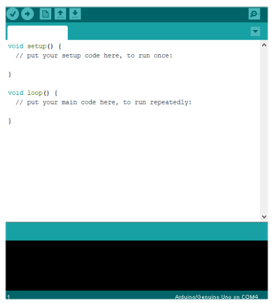
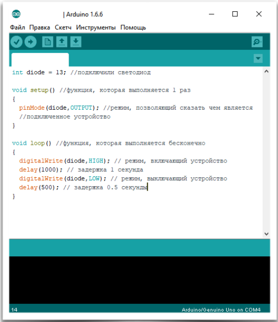
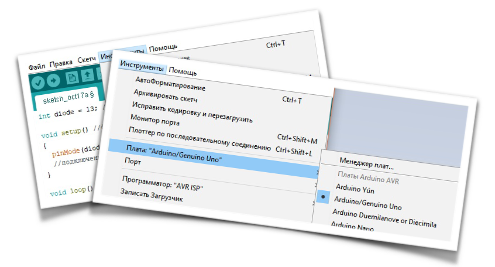
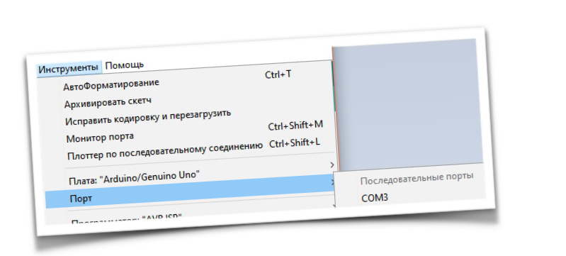
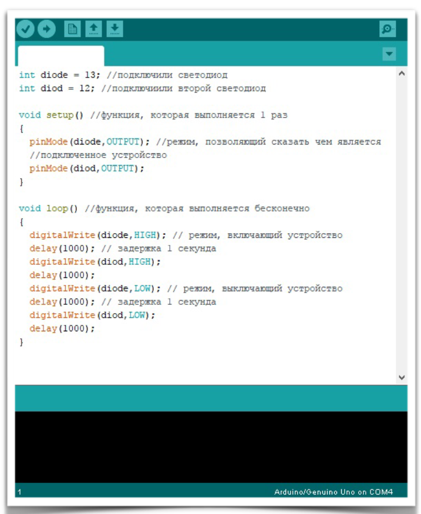

# Первая программа

Давайте, на личном примере, напишем самую простенькую программку:
моргаем светодиодом, который есть на плате длительностью в 1 секунду, пол секунды он не горит, и потом всё опять.

Здесь нам даже не нужен будет цикл, потому что в программной среде arduino предусмотрено 2 функции: **void setup()** и **void loop()**.

**void setup()** – функция, которая выполняется единожды, при загрузке программы на плату arduino и может повториться только в том случае, если мы заново включим arduino в сеть или же при нажатии кнопки «reset», присутствующей на плате

**void loop()** – соответственно функция, которая выполняется постоянно, когда плата подключена к источнику питания и при повторе функции не требует нажатия кнопки «reset».



И так, перед нами окно программы. По умолчанию сразу же заполнено функциями (сетап) и (луп) (буду писать так и далее, для удобства), но перед функциями мы можем задавать значения или добавлять какие-нибудь необходимые библиотеки (правда похоже на С++? ). Как было сказано ранее, на 13 порту платы ардуино имеется встроенный светодиод, вот с ним то мы и будем работать.

Для начала перед функцией (сетап) приписываем целочисленное значение нашему светодиоду – прописываем константы. В данном случае, пишем `int diode = 13;` что означает что на 13-ом порту у нас есть диод, которому мы присвоили целочисленное значение.

Теперь перейдем к нашим функциям, начнём с (сетап). Проинициализируем контакты в качестве выхода.  
Все контакты на плате Arduino могут принимать 2 значения: вход или выход. Для инициализации будем использовать команду `pinMode(x, OUTPUT/INPUT)`, где **х** – название переменной (в нашем случае diode), а **OUTPUT/INPUT** – оставляем что-то одно на выбор в зависимости от того, какая у нас программа. В нашем случае пишем `pinMode (diode, OUTPUT);` так как диод у нас должен быть источником извлечения информации, то есть для нас информация это его мигания.
Теперь перейдем к нашей бесконечной функции (луп). Всё что мы сделаем, это напишем, чтобы светодиод светил 1 секунду и не светил пол секунды. Для того, чтобы всё это осуществилось, используем команду `digitalWrite(x, HIGH/LOW)` – пример аналогичный с
pinMode.  
Получается:

```C
digitalWrite(diode, HIGH);
delay(1000);
digitalWrite(diode, LOW);
delay(500);
```

Вот и всё. Что такое **delay**? Всё просто. Delay – это команда задержки, а в скобочках
указывается количество миллисекунд, которое надо подождать, чтобы продолжить
программу. И того в 1-ой секунде 1000 миллисекунд, 500 миллисекунд – 0,5 секунды.

## Вот, как в итоге должен выглядеть ваш код



## Прошивка

Кликаем на кнопку **«инструменты»**, далее мы должны выбрать с какой arduino мы работаем, для этого выбираем параметр **«плата**:» и там выбираем **«Arduino/ Genuino Uno»** если мы работаем с arduino uno или же «Arduino Nano» если работаем с arduino nano, соответсвенно.



Далее надо убедиться, что arduino подключена к правильному порту, для этого нажимаем кнопку «порт» и убеждаемся в правильном номере порта, обычно это порты com3 или com5, но у вас, конечно же, может отличаться.



Всё сделали, всё подключили, но arduin’e всё равно от этого ни холодно ни жарко.  
Пора уже **заливать** в неё наш прекраснейший код. Для того, чтобы залить программу, надо сначала её **проверить**. Для этого, нажимаем **«галочку»**, которая находится под меню программы, и, если компилятор не выдал ошибок в программе, предложит сохранить вашу программу на компьютере. Программы в аrduino называются **«скетчами»**, сохраняйте ваши скетчи в одной общей папке, чтобы потом вы смогли по названию найти нужный скетч и использовать его в будущих проектах, и не забудьте **изменить** название вашего проекта на то, которое вы сможете потом в будущем легко определить ;)

Проверили, сохранили, всё хорошо. Но скетч до сих пор не на arduino? Правильно!) Мы только сделали все проверки, а теперь только можем **«заливать»** скетч на аrduino, для этого нажимаем кнопку **«→»**, которая находится справа от «галочки».

Всё. Вот теперь, действительно, можно увидеть то, что светодиод, находящийся на 13-
ом порту нашей arduino, моргает с такой частотой, которую задали мы.

## Самостоятельная работа

У вас теперь есть 2 светодиода. Вам надо, в программе, сделать так, чтобы сначала загорался один светодиод, потом второй, а потом первый гаснет и второй завершает. Интервал времени любой, который вам удобен, но советую что-то около 1 секунды.

Все выполнененные работы сохраняйте в отдельной папке с **нормальными** названиями, чтобы их можно было найти.

<details>
<summary>Ответ</summary>



</details>
