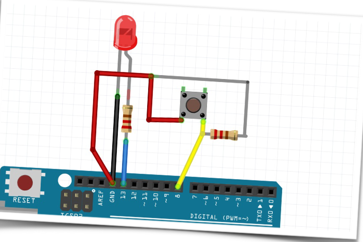

# Подключение кнопки

Переходим к чему-нибудь посложнее. Соберем схему, которая будет включать и
выключать светодиод по нажатию кнопки. Здесь нам помимо светодиода и кнопки
понадобятся 2 резистора: на 220 Ом и на 10 кОм. 220 Ом нужны для ограничения тока и
напряжения на светодиоде, а 10 кОм надо для того, чтобы напряжение на нашей кнопке
оставалось постоянным и убирались помехи. Можно использовать второй резистор куда
гораздо большего номинала, но нам хватит и этого.



А вот и сам код. Вроде бы как написали, самое время заливать его в arduino.


Всё работает здорово. Но это очень простой код, он будет работать и без
микроконтроллера, надо что то посерьёзнее. Например путь у нас будет так: мы нажимаем
на кнопку и светодиод загорается, ещё раз нажимаем и тухнет.

Для этого немного переделаем наш код:

```C
int switchPin = 8;
int ledPin = 13;
boolean lastButton = LOW;
boolean  ledOn = false;  // переменные для запоминания состояния системы
void setup()
{
   pinMode(switchPin, INPUT); // кнопка у нас является вводом информации, не так ли?
   pinMode(ledPin, OUTPUT); // а вот светодиод выводом
}
void loop()
{
   If (digitalRead(switchPin) == HIGH && lastButton == LOW)
     {
        ledOn = !ledOn; // перевернем значение чтобы включить светодиод
        lastButton = HIGH;
     }
else
     {
        lastButton = digitalRead(switchPin); // читаем сигнал с кнопки
     }
digitalWrite(ledPin, ledOn);
}
```

Сделали прогу, заливаем, смотрим. Хм, как-то странно, она работает периодически... очень странно. Что-то здесь не так.  
В чём здесь дело?  
Если вам кажется, что всё дело в **дребезжании** кнопки, то вы правы. Дребезжание кнопки, это когда наш сигнал продолжает поступать далее на долях миллисекунд **после** того, как мы уже **отпустили** кнопку:


**Что же с этим делать?**  
Давайте допишем программу, чтобы справиться с этим:

```C++
int switchPin = 8;
int ledPin = 13;
boolean lastButton = LOW;
boolean  ledOn = false;  // переменные для запоминания
состояния системы
boolean currentButton = LOW;
void setup()
{
   pinMode(switchPin, INPUT);
   pinMode(ledPin, OUTPUT);
}
boolean debounce (boolean last) // делаем
функцию которая добавит нам значение,
принимаемое до нажатия кнопки
{
   boolean current = digitalRead(switchPin); // узнаем значение кнопки сейчаc
   if (last != current) // если состояние кнопки изменилось
      {
          delay(5); // делаем задержку кнопки на 5 миллисекунд
          current = digitalRead (switchPin); // считываем значение кнопки по новой,
предполагая получить устаканившееся значение
      }
    return current; // возвращаем устаканившееся значение
}
void loop()
{
   currentButton = debounce (lastButton);
   if (lastButton == LOW && currentButton == HIGH)
      {
          ledOn = !ledOn; // перевернем значение чтобы включить светодиод
      }
   lastButton = currentButton;
   digitalWrite(ledPin, ledOn);
}
```

Теперь попробуем запустить программу по новой, давайте попробуем.  
Работает чётко!
