# Питание схемы

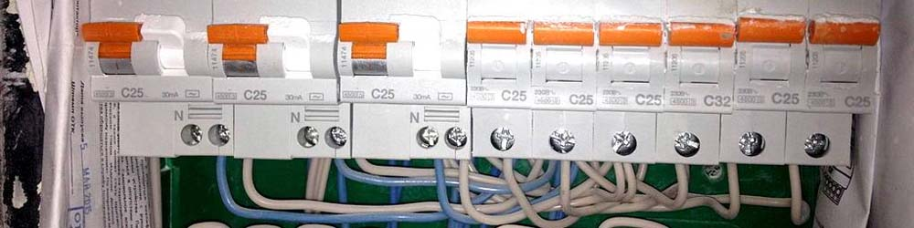
Питание электронного компонента или Ардуино-модуля всегда состоит из двух проводов:

- "Плюс": **+5V** или **+3.3V**. Может быть подписан на плате как 5V, 3.3V, 3V3, Vin, VCC, +. _Провод на схеме изображается красным цветом_.
- "Минус": общий провод, **0V**. Может быть подписан на плате как GND, COM, G, -. _Провод на схеме изображается синим или чёрным цветом_.
  Несколько моментов о питании:

- Нельзя превышать напряжение питания электронного компонента, иначе он сгорит. То есть провод с 5V нельзя подключать на пин, на котором написано 3V. А вот наоборот – можно: большинство модулей с питанием 5V будут работать от 3.3V. Это будет актуально при работе с платами на базе esp8266, которая работает от 3.3V.
- Подключать питание нужно очень внимательно: минус соединяется с минусом, а плюс – с плюсом. Если перепутать провода – в 99% случаев модуль сгорит, защиту на них делают редко.
- Даже если напряжение питания у модулей разное, **выводы GND всех компонентов схемы должны быть соединены вместе, потому что сигналы "ходят" относительно нулевого провода.**
- В Ардуино-проекте мы чаще всего используем макетку и подключаем питание всех модулей к выводам питания платы Arduino. Если в проекте используется несколько модулей, то отверстий для проводов питания может не хватить! Именно для этого по краям макетки сделаны длинные линии контактов с подписями плюс и минус: можно подключить питание от платы к ним, и уже от них разводить на остальные компоненты. Это будет называться **шиной питания**:
  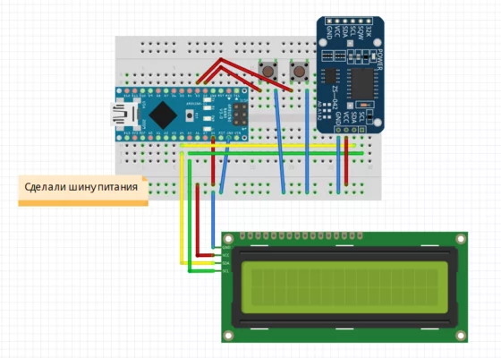

**_⚠️Внимание! Перед сборкой схемы или изменением существующей обязательно отключайте питание: USB кабель от Arduino и/или внешний источник. Случайное касание платы проводом может привести к выходу компонента из строя!_**

## Ток потребления схемы

Все знают закон Ома, но не все умеют им пользоваться. Применительно к источникам питания и потребителям он работает так: потребитель берёт такой ток, какой ему нужен для работы, он называется **ток потребления**:

- Сервопривод: ~500 мА во время движения
- Реле: ~60 мА при активации
- Датчики-модули ~1-10 мА
- Мотор: ~500 мА
- Плата Arduino: ~20 мА
- Плата Wemos: ~50 мА
- Дисплеи: ~40 мА
  При подключении в схему нескольких компонентов их **ток потребления суммируется**.

Источник питания в свою очередь имеет такой параметр как **максимальный ток**, который он может отдать без повреждений. Суммарный ток потребления компонентов схемы должен быть меньше, чем максимальный ток источника питания, иначе источнику питания будет “тяжело”. Также это означает, что можно спокойно подключать слабенький датчик хоть к 100 Амперному источнику питания, он возьмёт столько, сколько ему надо. Остальное останется “с запасом”.

Есть несколько способов питать плату Arduino и схему на её основе, у каждого есть свои плюсы, минусы и ограничения.

## Питание от USB

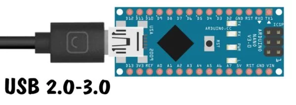

Питание от USB – **самый плохой** способ питания Ардуино-проекта. Почему? По линии питания +5V от USB стоит диод, выполняющий защитную функцию: он защищает порт USB компьютера от высокого потребления тока компонентами схемы и от случайного короткого замыкания (КЗ). КЗ продолжительностью меньше секунды не успеет сильно навредить диоду и всё может обойтись, но продолжительное замыкание превращает диод в плавкий предохранитель, выпускающий облако синего дыма и спасающий порт компьютера. После этого плата перестаёт определяться компьютером и диод нужно заменить.

- К китайским платам подходит диод SS14 (это 1N5819 в SMD исполнении) - ищите на AliExpress (ссылка) или магазинах электронных компонентов.

**⚠️Максимальный ток, который можно получить при питании таким способом - 500 мА.**

Слаботочный диод имеет ещё одну неприятную особенность: на нём падает напряжение, причем чем больше ток потребления схемы, тем сильнее. По USB нам приходит ровно 5V, после диода остаётся ~4.7V. Чем это плохо:

- Измерения с аналоговых пинов будут неточными.
- Некоторые железки чувствительны к напряжению питания, например LCD дисплеи: при питании от 5V они яркие и чёткие, при 4.7V - уже заметно теряют яркость и контраст. Если подвигать сервоприводом или включить реле – на диоде упадет ещё большее напряжение и дисплей ощутимо мигнёт.
- При более мощных нагрузках (выше 500-600 мА) микроконтроллер перезапустится, так как напряжение упадет ниже критического порога.

## Питание через стабилизатор

На большинстве плат Arduino стоит линейный стабилизатор, позволяющий питать плату и схему от более высокого напряжения. Стабилизатор обеспечивает качественное питание, компенсируя помехи, пульсации и изменение входного напряжения. Рассмотрим популярные платы Arduino Nano, NodeMCU и Wemos Mini. На схемах ниже они питаются от внешнего источника, а остальные компоненты - от выхода 5 или 3.3V с платы:
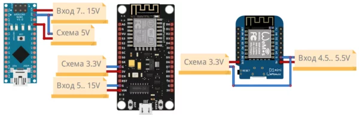

**⚠️У Arduino Nano после стабилизатора остаётся 5V, у NodeMCU и Wemos - 3.3V!**

- На Nano и NodeMCU стоит стабилизатор AMS1117, который позволяет снимать максимум до 2А при 7V и около 500 мА при 12V входного напряжения. Напряжение подаётся на пин Vin.
- На плате Wemos стоит слабый стабилизатор, причём у разных производителей разный, с максимальным напряжением от 5.5 до 7V и максимальным током до 500 мА. Лучше не экспериментировать и не подавать на него больше 5V. Напряжение подаётся на пин 5V.

Питание через стабилизатор возможно только в том случае, от платы не питаются мощные потребители тока, такие как сервоприводы, адресные светодиодные ленты, моторчики и прочее. Что можно: датчики, модули, дисплеи, реле (не более 3 одновременно в активном состоянии), одиночные светодиоды. Для проектов с мощной нагрузкой нужно использовать другое подключение.

## Питание напрямую

На всех рассмотренных платах есть вывод питания, который идёт напрямую на питание микроконтроллера (сюда же приходит выход от стабилизатора). Перед скобками указано идеальное напряжение питания, в скобках - допустимый диапазон.

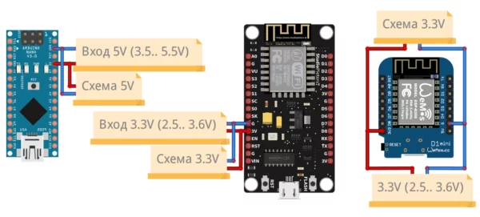

Таким образом Arduino Nano можно питать от блока питания на 5V вместе с остальной схемой, это очень удобно. Платы NodeMCU и Wemos - уже не очень удобно, блок питания на 3.3V найти довольно непросто. Зато отлично подходят две пальчиковых батарейки или аккумулятора.

Пример проекта с питанием напрямую (зелёная плата справа вверху - Micro USB), но на фото плата питается от бортового USB для прошивки.

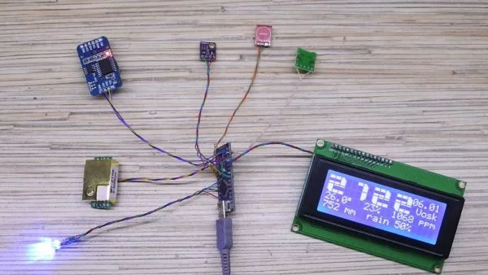

**⚠️Важно! На момент подключения к плате USB кабеля для прошивки внешнее питание должно быть подключено, иначе через плату может пойти большой ток!**

## Arduino Nano, пин 3V3

У Arduino Nano есть ещё один стабилизатор, выход с него - пин 3v3 с напряжением 3.3V. От этого пина можно питать модули, требующие питания 3.3V. Максимальный ток, который можно отсюда снять, зависит от стабилизатора (разные производители ставят разный), в основном это 100-200 мА, но лучше не снимать более 50 мА. На платах Nano от производителя Robotdyn стоит более мощный стабилизатор AMS1117-3.3, с которого можно снять 800 мА!

## Питание “мощных” схем

Резюмируя всё написанное выше, рассмотрим варианты питания проектов с большим потреблением тока на примере Arduino Nano и напряжения 5V. Точно так же по аналогии можно работать и с 3.3V платами на базе esp8266 (NodeMCU, Wemos).

Питать мощный проект (светодиоды, двигатели, нагреватели) от **5V** можно так: Arduino и потребитель питаются вместе от 5V источника питания (провода к нагрузке можно сделать толще, например если это светодиодная лента):

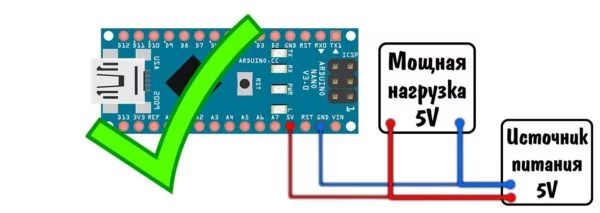

Пример: питание нескольких сервоприводов:

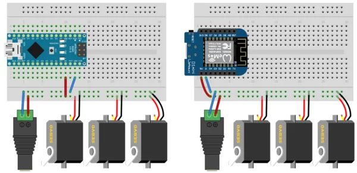

Питать мощный потребитель (выше 500 мА) от USB **через плату** нельзя, там стоит диод, да и дорожки питания слишком тонкие:

Что делать, если всё-таки хочется питать проект от USB, например от powerbank’а? Всё очень просто, режем кабель и подключаем:

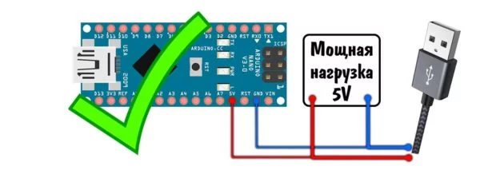

**⚠️Важно! На момент подключения к плате USB кабеля для прошивки внешнее питание должно быть подключено, иначе через плату может пойти большой ток!**

Можно защититься от этой опасности, поставив диод на питание Arduino. Да, в этом случае питание просядет до ~4.7V, но можно будет безопасно загружать прошивку:

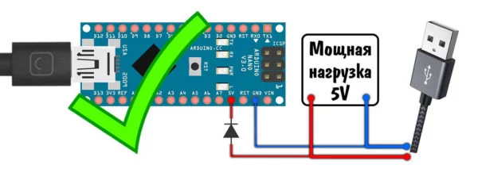

Если есть только блок питания на 12V, то у меня плохие новости: встроенный стабилизатор на плате не вытянет больше 500 мА:

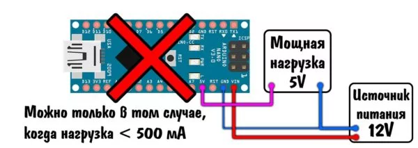

Но если мы хотим питать именно **12V нагрузку**, то проблем никаких нет: сама плата Arduino потребляет около 20 мА, и спокойно будет работать от бортового стабилизатора. А нагрузку запитаем напрямую от блока питания:

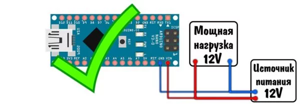

## Автономное питание

Бывает, что нужно обеспечить автономное питание проекта, т.е. вдали от розетки, давайте рассмотрим варианты. Также для этих целей пригодится урок по энергосбережению и режимам сна микроконтроллера.

- Питание в порт USB:
  - Самый обыкновенный Powerbank, максимальный ток – 500 мА. Напряжение на пине 5V и высокий уровень GPIO в этом случае будет равен ~4.7V. ⚠️ Внимание! У большинства Powerbank’ов питание отключается при нагрузке меньше 200 мА. Некоторые банки можно перевести в режим "слабой зарядки", тогда они будут питать схему.
- Питание в пин Vin (или штекер 5.5×2.1 на плате UNO/MEGA):
  - Любой блок питания/зарядник от ноута с напряжением 7.. 18 Вольт
  - 9V батарейка “Крона” – плохой, но рабочий вариант. Ёмкость кроны крайне мала.
  - Сборка из трёх литиевых аккумуляторов: напряжение 12.6.. 9V в процессе разряда.
  - Сборка из двух литиевых аккумуляторов: напряжение 8.4.. 6V в процессе разряда.
  - Энергосбережение – не очень выгодный вариант, т.к. стабилизатор потребляет небольшой, но всё же ток.
- Питание в пин 5V:
  - Для стабильных 5V на выходе – литиевый аккумулятор и повышающий до 5V модуль. У таких модулей обычно запас по току 2А, также модуль потребляет “в холостом режиме” – плохое энергосбережение.
  - Литиевый аккумулятор – напряжение на пине 5V и GPIO будет 4.2-3.5V, некоторые модули будут работать, некоторые – нет. Работа МК от напряжения ниже 4V не гарантируется, у меня работало в целом стабильно до 3.5V, ниже уже может повиснуть. Энергосбережение – отличное.
  - Пальчиковые батарейки (ААА или АА) – хороший вариант, 3 штуки дадут 4.5-3V, что граничит с риском зависнуть. 4 штуки – очень хорошо. Новые батарейки дадут 6V, что является максимальным напряжением для МК AVR и при желании можно так работать.
  - Пальчиковые Ni-Mh аккумуляторы – отличный вариант, смело можно ставить 4 штуки, они обеспечат нужное напряжение на всём цикле разряда (до 4V). Также имеют хороший запас по току, можно даже адресную ленту питать.
  - Платы с кварцем (тактовым генератором) на 8 МГц позволяют питать схему от низкого напряжения (2.5V, как мы обсуждали выше), отлично подойдут те же батарейки/аккумуляторы, также маломощные проекты можно питать от литиевой таблетки (3.2-2.5V в процессе разряда).
  - **Максимальный выходной ток с пина 5V ограничен током источника питания.**

## Помехи и защита от них

Если в одной цепи питания с Ардуино и другими микросхемами стоят мощные потребители, такие как сервоприводы, адресные светодиодные ленты, модули реле и прочее, на линии питания могут возникать помехи. Они могут приводить к сильным шумам измерений с АЦП, дергать прерывания и даже менять состояния пинов, нарушая связь по различным интерфейсам связи и внося ошибки в показания датчиков. Более сильные пульсации и просадки напряжения иногда могут привести к перезагрузке контроллера или его зависанию.

Более того, помеха может прийти откуда не ждали – по воздуху, например от электродвигателя или любой другой катушки. “Большие дяди” в реальных промышленных устройствах делают очень много для защиты от помех, этому посвящены целые книги и диссертации. Мы с вами рассмотрим самое простое, что можно сделать дома на коленке.

- Питать логическую часть (Ардуино, слаботочные датчики и модули) от **отдельного** малошумящего блока питания 5V, то есть разделить питание логической и силовой частей, а ещё лучше питаться в пин Vin от блока питания на 7-12V, так как линейный стабилизатор даёт очень качественное напряжение.
- Поставить **конденсаторы по питанию платы**, максимально близко к пинам 5V/3V и GND: электролит 6.3V 100-470 uF (мкФ, ёмкость зависит от качества питания: при сильных просадках напряжения ставить ёмкость больше, при небольших помехах хватит и 10-47 мкФ) и керамический на 0.1-1 uF. Это сгладит помехи даже от сервоприводов;

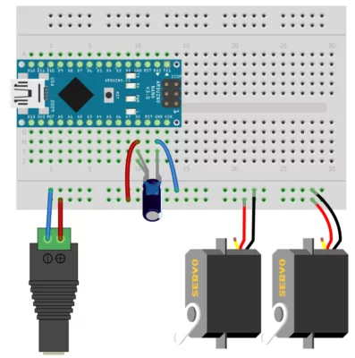

- У “выносных” на проводах элементах системы (кнопки, крутилки, датчики) **скручивать провода в косичку**, преимущественно с землёй. А ещё лучше использовать экранированные провода, экран подключать на GND схемы. Таким образом защищаемся от электромагнитных наводок;
- **Металлический и заземленный корпус** устройства (или просто обернутый фольгой), на который заземлены все компоненты схемы – залог полного отсутствия помех и наводок по воздуху.

Ещё лучше с фильтрацией помех справится LC фильтр, состоящий из индуктивности и конденсатора. Индуктивность нужно брать с номиналом в районе 100-300 мкГн и с током насыщения больше, чем ток нагрузки после фильтра. Конденсатор – электролит с ёмкостью 100-1000 uF в зависимости опять же от тока потребления нагрузки после фильтра. Подключается вот так, чем ближе к нагрузке – тем лучше:

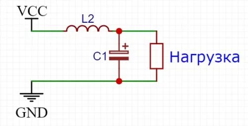

Подробнее о расчёте фильтров можно почитать [здесь](http://www.kondratev-v.ru/samostoyatelnye-rasschety/raschet-filtrov-vypryamitelya.html).

## Главный Глупый Вопрос

У новичков в электронике, которые не знают закон Ома, очень часто возникают вопросы вида: “а каким током можно питать Ардуино“, “какой ток можно подать на Ардуино“, “не сгорит ли моя Ардуина от от блока питания 12V 10A“, “сколько Ампер можно подавать на Arduino” и прочую чушь.  
Запомните: **вы не можете подать Амперы, вы можете подать только Вольты, а устройство возьмёт столько Ампер, сколько ему нужно**.  
В случае с Arduino – голая плата возьмёт 20-22 мА, хоть от пина 5V, хоть от Vin.  
Ток, который указан на блоке питания, это **максимальный ток, который БП может отдать без повреждения/перегрева/просадки напряжения**.  
Беспокоиться стоит не об Arduino, а об остальном железе, которое стоит в схеме и питается от блока питания, а также о самом блоке питания, который может не вывезти вашу нагрузку (мотор, светодиоды, обогреватель).  
Общий ток потребления компонентов не должен превышать возможностей источника питания, вот в чём дело. А будь блок питания хоть на 200 Ампер – **компоненты возьмут ровно столько, сколько им нужно**, и у вас останется “запас по току” для подключения других (примечание: некоторые мощные, но "умные" блоки питания не будут питать слабую Arduino, т.к. она потребляет слишком маленький ток).  
Если устройство питается _напряжением_, то запомните про максимальный ток источника питания очень простую мысль: **кашу маслом не испортишь**.
