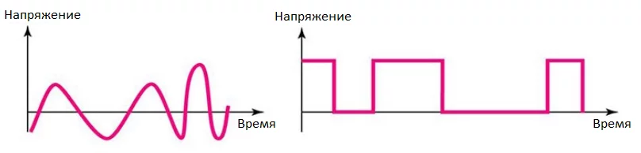

# Базовые понятия

## Электричество

- **_Электричество_** - вид энергии, которая может передаваться по проводникам (проводам) в виде заряженных частиц. _Аналогия: текущая по трубе вода._
- **_Источник электричества_** - устройство, которое может выдавать электрическую энергию (розетка, блок питания, батарейка, аккумулятор). _Аналогия: водонапорная башня._
- **_Потребитель электричества_** - устройство, которое потребляет электрическую энергию (радиоэлемент, микросхема, электрический прибор). _Аналогия: водяная турбина._
- **_Электрическая цепь_** - состоит из источника, потребителя и соединяющих их проводников (проводов).
  - Если цепь замкнута, по проводникам идёт электрический ток.
  - Электрический ток всегда идёт **по двум проводам**: выходит из "плюса" и приходит в "минус".
  - Минусовой провод на схеме чаще всего изображается **чёрным** или **синим**, а плюсовой - **красным**.  
    
- **_Электрическое напряжение_** - основная характеристика электричества, показывает его "потенциал". Измеряется в Вольтах (V, В), обозначается **U**. _Аналогия: давление воды, точнее высота водонапорной башни - чем она выше, тем выше давление внизу._
  - У источников это **выходное напряжение** - такое напряжение они выдают. Таким образом напряжение в цепи зависит от источника. _Аналогия: давление воды._
  - У потребителей это **напряжение питания** - такое напряжение нужно подать, чтобы устройство работало. Если подать меньше минимального - оно не будет работать. Если подать больше максимального - скорее всего сгорит. _Аналогия: слишком мощный напор воды сломает турбину, если она на это не рассчитана, а слишком слабый - не сможет её вращать._
  - Напряжение - **относительная величина**, измеряется между двумя точками с разным потенциалом. Например у источника питания мы будем измерять напряжение между его контактами. _Аналогия: высота столба воды в водонапорной башне (от трубы снизу до поверхности воды сверху)._
- **Электрический ток** - показывает, "как много электричества" проходит через провод, фактически - количество заряженных частиц в секунду. Измеряется в Амперах (А), обозначается **I**. _Аналогия: объём воды, проходящий через трубу за единицу времени._
  - У источников это **допустимый ток** - такой ток можно снять с источника без вреда для него. Другими словами, подключенная к источнику схема не должна потреблять больше тока, чем может выдать источник.
  - У потребителей это **ток потребления** - такой ток будет потреблять устройство, если подать на него напряжение. Таким образом **_ток в цепи зависит от потребителя_**.
  - Потребляемый ток измеряется "в разрезе" провода, как если бы мы измеряли поток воды через трубу.
- **Электрическое сопротивление** - показывает, какой ток будет потребляться устройством при известном напряжении. Чем выше сопротивление, тем меньше ток. Измеряется в Омах (Ом, Ohm), обозначается **R**. _Аналогия: способность трубы пропускать воду. Узкая, ребристая и длинная труба будет пропускать меньше воды при том же давлении (напряжении), чем широкая, гладкая и короткая._
- **Закон Ома** - связывает напряжение, ток и сопротивление одним уравнением: **I = U / R**.
- **Ёмкость аккумулятора** - измеряется в Ампер*часах (А*ч). Показывает, какой ток может отдавать аккумулятор в течение одного часа. Зная ток потребления, можно узнать время работы от аккумулятора. _Аналогия: объём воды в водонапорной башне_.

## Электрический сигнал

Электричество может использоваться не только для питания электронных компонентов и приборов, но и для передачи данных. В этом случае "потребитель" (приёмник) имеет очень высокое сопротивление, то есть при подключении к нему источника сигнала в цепи начинает течь очень маленький, почти нулевой ток. Но приёмнику в этом случае интересно именно напряжение источника - ведь цепь замкнута и он может его измерить. Электрический сигнал бывает двух типов: аналоговый и цифровой.

**Аналоговый сигнал** - напряжение такого сигнала может меняться с очень маленьким шагом в Вольтах. В большинстве случаев _такой сигнал "непрерывен", то есть не может измениться резко_: в любой момент времени мы можем его измерить и перевести в нужную величину (например, напряжение в температуру).

- **Достоинства:** простота реализации, множество дешёвых аналоговых датчиков на рынке, для обработки не нужен микроконтроллер, схема может быть полностью аналоговой.
- **Недостатки:** аналоговый сигнал может исказиться при передаче, могут наложиться внешние электромагнитные помехи, внутренние помехи питания, величина сигнала (напряжение) может уменьшиться из за сопротивления проводов.

**Цифровой (дискретный, логический) сигнал** - напряжение такого сигнала имеет всего два значения, низкое и высокое: 0V и 3.3V/5V. С точки зрения данных это 0 (ноль) и 1 (единица).

- Максимальное напряжение такого сигнала называется логическим уровнем и в большинстве случаев равно 3.3V или 5V, это зависит от конкретной модели компонента.
- Логический уровень практически всегда совпадает с напряжением питания компонента, то есть если микросхема питается от напряжения 5V, то и логический уровень у неё будет 5V.
- Приёмник логического сигнала воспринимает за 0 (ноль) любое напряжение, меньшее половины логического уровня, и за 1 (единицу) - большее его половины. Таким образом искажённый сигнал в большинстве случаев будет обработан правильно.

В некоторых случаях двух состояний достаточно (кнопка нажата/отпущена, лампочка выключена/включена), но для команд и численных значений этого мало, поэтому для передачи данных используют цифровые **интерфейсы связи**. Они бывают разные и подробнее мы рассмотрим их в отдельном уроке, но суть остаётся той же: напряжение цифрового сигнала меняется резко и может принимать только два значения.

- **Достоинства**: надёжность, хорошая защита от помех, высокая скорость передачи.
- **Недостатки**: сложность реализации относительно аналогового сигнала, для работы нужны более дорогие "цифровые" компоненты.

Аналоговый и цифровой сигналы:

## Программирование

- **Программирование** - процесс написания программы. Также под программированием может подразумеваться настройка некоторых устройств (программируемая микросхема).
- **Язык программирования** - совокупность специальных слов-операторов, синтаксиса и правил оформления кода.
- **Код программы** (на языке программирования) - код, который пишет программист на языке программирования. Это читаемый, красиво оформленный текст, состоящий из слов и цифр.
- **Машинный код (бинарник)** - код программы, который выполняется процессором. Этот код полностью состоит из цифр, обычный человек не сможет его прочитать и понять. Файл обычно имеет расширение .hex или .bin.
- **Компилятор** - программа, которая переводит код программы в машинный код.
- **Компиляция** - процесс перевода кода программы в машинный код.
- **Прошивка (как глагол)** - процесс загрузки скомпилированного кода в память микросхемы.
- Также **прошивкой (как существительное)** может называться сам код программы или бинарник ("загрузить прошивку").
- **Программатор** - специальное устройство для загрузки скомпилированного кода в память микросхемы.
- **Интегрированная среда разработки (IDE)** - программа, в которой можно писать код, компилировать его и загружать в память микросхемы.
- **Скетч** - в Arduino-среде так называется файл с программой, который открывается в Arduino IDE.
- **Алгоритм** - чёткая последовательность действий для решения определённой задачи (например, алгоритм вычисления числа Пи).
- **Функция** - отдельный участок кода программы, который можно вызвать по имени из другого места программы.
