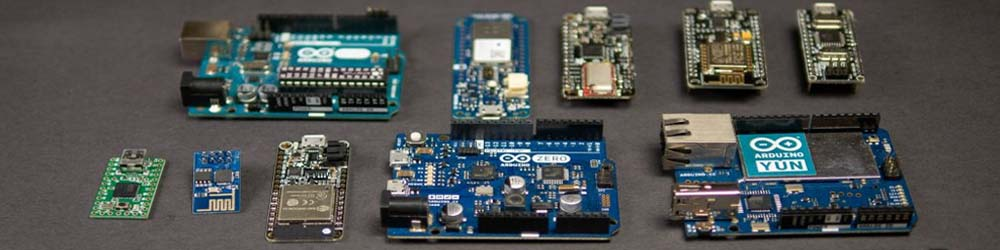

# Что такое Arduino?

Что такое **Arduino**? Формально это торговая марка, под которой выпускаются официальные платы и программы. Название Arduino идёт от одноименного названия забегаловки в Италии, где создатели любили пропустить по рюмочке. С точки зрения использования, Arduino - это платформа для разработки электронных устройств, точнее их прототипов и макетов. Включает в себя железо (платы) и софт (среда разработки).

Семейство Arduino – несколько моделей так называемых **отладочных плат**. Отладочная плата представляет собой как ни странно печатную плату, на которой стоит микроконтроллер (далее МК) – та самая штука, которую мы будем программировать. В младших платах Arduino используются микроконтроллеры **AVR** (UNO, Nano, Mega, Leonardo), в современных моделях стоят более мощные ARM Cortex для более серьёзных проектов.

Ардуино является открытой платформой, поэтому модельный ряд постоянно пополняется неофициальными платами от других производителей, такие платы называют "Arduino-совместимыми". С ними можно работать в официальной программе Arduino IDE, писать на том же языке с тем же набором команд и даже использовать те же библиотеки! В качестве примера: это платы Teensy, платы на базе МК esp32 и esp8266 (Wemos, NodeMCU), различных китайских клонов и так далее.

Рассмотрим, из чего состоит платформа и какие задачи она решает.

## Железо (аппаратная часть)

Как собрать электронное устройство на базе МК? Нужно:

- Сделать печатную плату, ибо сам МК очень маленький и паять его неудобно.
- Обеспечить тактирование МК (те самые мегагерцы, как в обычном компьютере) - подключить тактовый генератор.
- Добавить необходимую обвязку: фильтры по питанию, кнопку перезагрузки, некоторые МК требуют подключения резисторов к определённым пинам, и так далее.
- Подключить остальные компоненты проекта: расположить их на плате или предусмотреть штекеры.
- Обеспечить стабильное питание схемы, возможно даже в широком диапазоне питающего напряжения.
- Некоторые МК нужно "настроить" при помощи программатора.
- Загрузить прошивку при помощи программатора.

Звучит сложно, именно поэтому ребята из Arduino решили объединить всё это на одной плате: уже настроенный микроконтроллер и всё необходимое для его работы, стабилизатор напряжения, и самое главное - программатор, он тоже расположен на плате и для загрузки прошивки достаточно просто подключить USB кабель! Ноги МК выведены на рейку с пинами (стандартный шаг 2.54 мм), что позволяет работать с платой на брэдборде (макетная плата) и быстро подключать к ней любые компоненты. Изначально сложную задачу упростили до электронного "конструктора", именно поэтому Arduino стали настолько популярны.

## Софт (программная часть)

Как запрограммировать МК? Нужно:

- Написать прошивку (при помощи любого текстового редактора).
  Скомпилировать прошивку (для AVR - при помощи бесплатного консольного компилятора avr-gcc).
- Загрузить прошивку в МК (для AVR - при помощи консольной утилиты avrdude).

Для этого у Arduino есть своя IDE (Integrated Development Environment) – интегрированная среда разработки Arduino IDE. Она представляет собой текстовый редактор, умеет компилировать и загружать код. А также менеджер библиотек и поддержку неофициальных плат. Таким образом весь процесс прошивки сводится к одному щелчку по кнопке загрузить: никаких настроек, никаких плясок с бубном, ничего лишнего. Подробнее об Arduino IDE мы поговорим в отдельном уроке.

Также к программной части можно отнести:

- "Язык" Arduino, который на самом деле является просто встроенной библиотекой. У всех Arduino-совместимых плат есть одинаковый набор функций, поэтому проект можно практически без изменений перенести с одной платы на другую.
- Библиотеки, которые в сотни раз упрощают работу с модулями и прочими железками. Для Arduino-среды существует около 5000 библиотек, которые охватывают все Arduino-модули и некоторые микросхемы. Также среди библиотек можно найти различные интересные алгоритмы обработки данных и прочие полезные штуки.

Простота и удобство разработки в совокупности с огромным множеством плат на разных МК и набором библиотек на все случаи жизни сделало Arduino самой простой и удобной платформой для изучения робототехники и создания прототипов электронных устройств.

## Программирование

На каком языке программируется Arduino? Многие называют его "упрощённый C++", "разновидность C++", "язык Ардуино", сами Arduino называют его "Arduino Wiring". Но на самом деле язык здесь - **обычный C++** (си-плюс-плюс) со всем соответствующим ему синтаксисом и возможностями, операторами и прочими инструментами (версия C++17). Но есть пара моментов:

- Среда Arduino IDE слегка меняет стандартный вид программы на C++ и действительно упрощает понимание для новичка. В то же время Arduino IDE не заставляет писать программу "по-Ардуиновски", можно оформить её как обычную программу на Си (объявить int main(){} и писать свой код).
- Arduino IDE автоматически подключает в код библиотеку Arduino.h, которая содержит базовый набор функций для работы с МК, а также некоторые константы и математические функции, которые пришли из открытого фреймворка Wiring.
- В AVR Arduino используется компилятор avr-gcc, в котором нет стандартных для компьютерной разработки std:: библиотек. Но зато есть свои библиотеки, ориентированные на работу с микроконтроллером.

Дополнительно в Arduino IDE нам доступно:

- Встроенные библиотеки для работы с интерфейсами связи и памятью.
- В папке с программой лежит набор стандартных библиотек: для LCD дисплея, шагового мотора, сервопривода и некоторых других железок.
- [Только для AVR Arduino] Вместе с компилятором идёт набор низкоуровневых библиотек для AVR (сон, progmem, watchdog и многие многие другие).
- Работа с микроконтроллером "напрямую" при помощи регистров.
- Можно писать на ассемблере, взяв под контроль каждый такт работы МК.

Если вы научитесь свободно программировать Ардуино и вдруг перейдете к разработке программ на том же C++ в более взрослых средах разработки, вы будете неприятно удивлены большим количеством дополнительного кода, который придется писать руками. И наоборот, если умеющий в C++ человек посмотрит на типичный ардуино-код, он скажет “да как это вообще работает?”. Компилятор в Arduino IDE настроен на максимальную всеядность и прощение ошибок, потому что это обучающая платформа.

## Библиотеки

Жизнь рядового ардуинщика неразрывно связана с библиотеками, потому что огромное комьюнити за годы своего существования сделало огромное количество этих самых библиотек на все случаи жизни и для всех продающихся датчиков и модулей. Библиотека это набор файлов с кодом, которым мы можем пользоваться просто ознакомившись с документацией или посмотрев примеры. Такой подход называется “черным ящиком”, мы можем даже не догадываться, насколько сложный код содержится в библиотеке, но будем с лёгкостью пользоваться возможностями, который этот код даёт. Купили модуль – нашли библиотеку – открыли пример – всё, результат достигнут.

## Чистый Си? Писать без библиотек?

Очень многие считают, что эффективный код нужно писать без библиотек, чистым полотном. Это полнейшая чушь, потому что:

- Современные микроконтроллеры имеют достаточно памяти для того, чтобы разработчик мог позволить себе сэкономить время и использовать готовые инструменты. Более того, серьёзные разработки делаются с использованием операционных систем реального времени, которые сами по себе являются огромной тяжёлой библиотекой. Никто не пишет на ассемблере, за окном не 1980 год.
- Компилятор "вырежет" неиспользуемый код из библиотеки.
- Если писать крупный проект чисто голым кодом – это будет полотно на несколько тысяч строк, в котором невозможно будет разобраться. Программу разбивают на файлы – по сути на те же самые библиотеки! Некоторые алгоритмы и части программы изначально удобно обернуть в независимую библиотеку и использовать в том числе для других проектов, чтобы не писать заново. Так что писать без библиотек невозможно в принципе, неважно скачаете ли вы её с интернета или напишете сами.
- Если у вас в проекте одна кнопка – нет большой разницы, описывать её вручную или использовать библиотеку. Но как только появляется ещё одна кнопка – с точки зрения памяти гораздо эффективнее использовать библиотеку, потому что код обработки не будет дублироваться. К этому мы вернёмся в уроке про создание крупных проектов.
- Если вы новичок, то в 99% библиотека из интернета будет написана и оптимизирована в разы лучше, чем ваш код.

## Возможности

Зачем учиться работать с Ардуино и электроникой в целом?

- Это невероятно интересное, техническое, развивающее мозги и относительно дешёвое “DIY” хобби с бесконечным количеством идей и способов их реализаций
- Возможность создания узко-специальных электронных устройств и станков, аналогов которым нет в продаже или они слишком дорогие. В том числе для личных нужд или работы (знакомый ювелир сделал себе контроллер для муфельной печи, который стоит очень дорого).
- Возможность создания уникальных устройств с целью выхода на краудфандинг и запуска своего бизнеса.
- Отличная практика в программировании и электронике, особенно перед обучением на соответствующую специальность.
- Возможности в целом: автоматизация, автоматическое регулирование процессов, дистанционное управление, мониторинг различных величин, носимые и стационарные электронные устройства различного назначения.

## Хейтеры платформы

В мире серьезных программистов и разработчиков очень не любят Ардуино. Почему? Рассмотрим несколько популярных негативных комментариев о платформе.

- В среде Arduino IDE работа с микроконтроллером упрощена настолько, что ардуинщику вообще ничего не нужно знать о его архитектуре и о том, как он вообще программируется и настраивается: все сделано в виде готовых и понятных функций.
  - С каких пор удобство и простота стали плохими? Для новичка это единственный способ познакомиться с миром робототехники без изучения кипы документации и получения соответствующего образования. Ардуино создана в первую очередь для обучения, и во вторую – для быстрого и удобного создания прототипов электронных устройств, это её фишка.
- Это всё конечно хорошо, но скрытый за ширмой дружелюбного “Ардуино Вайринга” код ужасает: за безобидными на первый взгляд функциями кроются полотна кода, который что-то проверят, перепроверяет, перенастраивает уже настроенное и делает многие другие на первый взгляд ненужные вещи. Это безобразие работает очень медленно и занимает кучу места!
  - Да, стандартные функции имеют кучу защит от дурака новичка, они тяжёлые и медленные. Но новичок и не сможет написать такой код, где скорость и память будут настолько критичны! А если понадобится, то к этому времени он уже будет в состоянии писать код оптимально и найдёт на моём сайте или в другом месте в Интернете быстрые аналоги Ардуино-функций или напишет их сам. И ещё один момент: ядро Ардуино устроено так, что обеспечивает совместимость кода и библиотек для всех Ардуино-плат. Начали делать проект на Arduino NANO и памяти/ног стало не хватать? Переносим проект на Arduino MEGA и продолжаем работать. NANO оказалась слишком велика для проекта? Переносим на ATTiny85, даже не открывая документацию: большинство библиотек работают на всех Ардуино-совместимых платах, это очень жирный плюс, хоть и в ущерб производительности и памяти.
- Стандартные функции из Arduino.h описывают незначительную часть всех возможностей и настроек, которые есть в микроконтроллере.
  - А никто и не обещал вам HAL! Возможности МК раскрываются при использовании библиотек (см. список библиотек), благо сообщество у платформы действительно огромное. Также всегда можно научиться работать с даташитом и регистрами и настраивать всё что угодно и как угодно вручную.
- Arduino IDE “скрывает” от пользователя важные низкоуровневые настройки.
  - И правильно делает! Одна ошибка – и можно остаться с заблокированным МК. При желании через Arduino IDE можно и фьюзы прошить, и под другие частоты настроить, об этом читайте вот в этом уроке.
- Ардуино для детей! Серьёзные дяди работают с “голым камнем”.
  - Всё верно, для детей и домохозяек. Плата Ардуино задумана для создания макетов, прототипирования, её можно рассматривать как часть электронного “конструктора” для обучения. На плате есть вся необходимая обвязка, почему не использовать её даже как сердце готового проекта?
- Arduino IDE для детей! Серьёзные дяди работают во взрослых средах разработки.
  - Верно, но есть небольшой нюанс: Arduino IDE официально бесплатная, после простой установки (Далее, Далее, Далее, Готово) она сразу готова к работе: достаточно выбрать плату из списка и начать писать код. Взрослые среды разработки требуют взрослого подхода и порог вхождения для работы с ними несоизмеримо высок. Помимо непростой установки и настройки вас ждут расширенные настройки самого микроконтроллера в ручном режиме, чтение документации и даташитов, “взрослый” интерфейс и множество нюансов в самом программировании и настройках компилятора. Времени на изучение этого всего уйдёт много, а нормальных уроков вы скорее всего не найдёте.
- Ардуинщики ходят по замкнутому кругу, они никогда не разовьются дальше мигания светодиодом.
  - Платформа ничем не ограничивает разработчика, но если он сам не захочет - не разовьётся.
- На Ардуино нельзя создать что-то реально сложное и интересное.
  - Скажите это ЧПУ станкам (прошивка GRBL), 3D принтерам (прошивка Marlin), квадрокоптерам и самолётам (прошивка Ardupilot) и многим другим крупным проектам.
- А STM32 лучше! И в разы мощнее! И возможностей у неё больше! И она дешевле!!!
  - Да, да, да. Но не забывайте про порог вхождения и размер сообщества с контентом, библиотеками и примерами “для новичков”, а также о сложности работы с STM в целом. Посмотрите видосы вот на этом канале и сравните происходящее с Arduino. Что касается возможностей и скорости работы – для большинства любительских проектов Arduino (ATmega328/2560) будет более чем достаточно, особенно если уметь писать оптимальный код.
- Качество кода “из Интернета” просто ужасное.
  - Да, из-за простых, но понятных стандартных примеров аудитория ардуинщиков выросла очень быстро и буквально завалила интернет своими проектами, завлекая тем самым в это хобби других новичков. 99% учебных примеров, примеров работы с библиотеками и модулями написаны простенько и ужасно неоптимально: int переменные для всего подряд, вездесущий delay, блокирующие циклы и прочее, помимо богомерзких ардуино-функций. Люди берут эти примеры как основу и продолжают дальше писать так же. Но эти люди стоят на пороге очень большой двери под названием робототехника. Перешагнув через этот порог, отбросив все кривые примеры и научившись грамотно выстраивать структуру своего кода, они попадают в мир безграничных возможностей для творчества и исследования, мир бесконечно интересных и разнообразных проектов на Arduino. Для этого я и пишу данные уроки.

Что ещё хочется сказать по поводу негатива от “профессионалов” – в большинстве случаев они просто завидуют: в "их время" для создания даже простенького проекта на базе микроконтроллера нужно было потратить огромное количество времени на изучение документации на английском языке на конкретную модель МК, на все остальные железки и микросхемы в проекте, научиться работать в недружелюбной среде разработки, развести и спаять плату, купить дорогой программатор и прочее прочее. А в наше время можно купить плату за 150р, воткнуть её в USB, запустить программу вида “блокнот с кнопкой Загрузить” и начать кодить с использованием огромного количества готовых библиотек и примеров для практически любых железок на рынке, а на любой свой вопрос можно найти ответ в гугле. Реально, у ребят просто пригорает одно место =)
