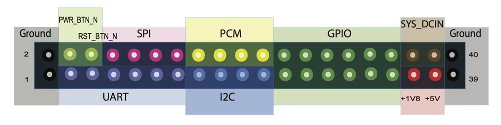
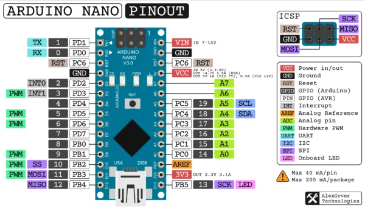
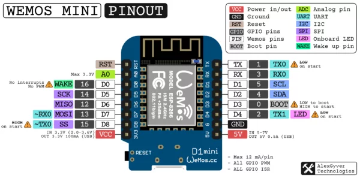

# Что умеет микроконтроллер?

Микроконтроллер - чрезвычайно универсальное устройство, на его основе можно сделать бесконечно много разных электронных устройств, как полезных, так и бесполезных. Под управлением микроконтроллеров работает любая техника, в которой есть какие-то настройки, режимы или автоматизация (стиральная машина, микроволновка, мультиварка...), некоторые узлы автомобилей, станки с ЧПУ, простенькие гаджеты и так далее.

Что же делает МК настолько мощным и универсальным инструментом? Ведь фактически он умеет делать всего три вещи\*:

- Измерять напряжение на пине
- Выдавать напряжение с пина
- Программироваться

(\*) - ещё у МК может быть собственный беспроводной интерфейс, но это уже частный случай.

В том то и дело, что этого достаточно для решения всех мыслимых и немыслимых задач! Микроконтроллер может управлять любой внешней нагрузкой, опрашивать кнопки/крутилки/энкодеры/клавиатуры/джойстики, может работать практически с любыми датчиками, общаться с любыми сторонними микросхемами, выводить информацию на дисплей, в том числе сенсорный, управляться через Интернет из любой из точки планеты и многое другое. Самое важное, что всё это может работать абсолютно в любых сочетаниях и быть запрограммировано огромным количеством способов, то есть одна маленькая микросхема может стать сердцем бесконечного количества электронных устройств и проектов!

## Что такое МК?

Микроконтроллер - это сильно навороченная программируемая микросхема, самый простой аналог - компьютер, точнее системный блок (без блока питания). Да, вы не ослышались! Микроконтроллер работает сам по себе, на нём может быть запущена простенькая операционная система, может даже быть выход в Интернет, а мы можем подключать к нему устройства ввода, датчики, дисплеи и прочие железки. Чем не компьютер?

Внутри любого микроконтроллера находится несколько аппаратных блоков, все они соединены между собой:

- **Ядро** (процессор) - отвечает за работу всех остальных блоков, связывает их между собой. Сам состоит из десятка элементов (кэш, набор вычислительных блоков, и т.д.). Аналог - процессор компьютера.
- **Flash память** - постоянное запоминающее устройство (ПЗУ). Хранит исполняемый код программы, также может хранить статические данные (изображения, веб-страницы, текст, таблицы с числами, и т.д.). Не очищается после сброса питания. Аналог - жёсткий диск компьютера.
- **SRAM память** - оперативное запоминающее устройство (ОЗУ). Хранит данные, изменяющиеся в процессе работы программы (промежуточные результаты вычислений, значения переменных, принятые от внешних устройств данные и т.д.). Очищается после сброса питания. Аналог - оперативная память компьютера.

Также в МК могут быть и другие блоки:

- GPIO (General Purpose Input-Output) - вход-выход общего назначения. Измеряет поданный на пин цифровой сигнал, либо выдаёт его с пина. Подробнее в этом уроке. Пины GPIO мы будем называть цифровые пины.
- АЦП (ADC, аналогово-цифровой преобразователь) - измеряет поданное на пин напряжение, аналоговый сигнал, и передаёт в программу. Подробнее в этом уроке. Такие пины мы будем называть аналоговые пины.
- ЦАП (DAC, цифро-аналоговый преобразователь) - выдаёт указанное напряжение с пина (аналоговый сигнал).
- Таймер (счётчик) - считает такты работы процессора
  - Позволяет с очень высокой точностью (до наносекунд) измерять время.
  - Часто таймер используется для генерирования ШИМ сигнала на своих выводах, они помечаются как PWM. Подробнее в этом уроке. Такие пины мы будем называть ШИМ-пины.
- Watchdog - данный блок позволяет перезагрузить МК, если он завис, а также выйти из спящего режима.
- Интерфейсы связи - нужны для связи с внешними устройствами, т.е. для обмена данными (получение значений с датчика, отправка данных по радио и т.д.). По сути МК может воспроизвести любой интерфейс связи при помощи GPIO, но это будет довольно затратно для процессора. Поэтому некоторые интерфейсы реализованы отдельно и работают самостоятельно, обмениваясь с ядром готовыми данными. Самые популярные интерфейсы:
  - UART - связь с одним внешним устройством. По одному проводу передаёт, по второму - принимает. Может работать только на передачу или только на приём, используя один провод. Названия пинов:
    - RX (Receive) - приём.
    - TX (Transmit) - передача.
  - I2C - адресная шина, можно подключить до 128 устройств одновременно всего по двум проводам. Названия пинов:
    - SDA (Serial DAta) – линия данных.
    - SCL (Serial CLock) – линия синхронизации.
  - SPI - можно подключить сколько угодно устройств, но каждое требует логический сигнал (пин) для выбора. Требует два провода для передачи в одну сторону или три - для обмена данными (одновременный приём и передача). Самый быстрый из перечисленных интерфейсов. Названия пинов:
    - MOSI (Master Output Slave Input) – линия данных от МК к внешней микросхеме.
    - MISO (Master Input Slave Output) – линия данных от внешней микросхемы к МК.
    - SCLK (Serial CLocK) – линия синхронизации.
  - I2S - специальный интерфейс для передачи цифрового аудио сигнала.

## Распиновка

Как вы наверное поняли, микроконтроллер - это микросхема с кучей ножек. У каждой ножки есть своя функция, в частности у блоков GPIO и интерфейсов связи есть свои личные ноги. Для экономии размера и уменьшения количества ног микросхемы производители практически всегда объединяют несколько функций на одной ножке. Чтобы понять, куда подключать внешнюю "железку", нужно посмотреть на распиновку (pinout) микросхемы или платы: это картинка, на которой подписаны функции всех ножек МК или пинов платы. Вот для примера упрощённые распиновки плат Arduino Nano и Wemos Mini, на них вы найдёте уже знакомые из предыдущей главы аббревиатуры:

